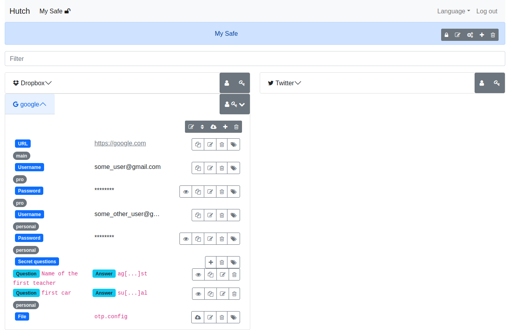

# Hutch

Online password and secret locker.

Store password and other secret data in an encrypted safe on the server.

Can generate random password and answers to _secret questions_.

The API backend is fully written in language C, it's based on [Ulfius](https://github.com/babelouest/ulfius) HTTP framework, [Hoel](https://github.com/babelouest/hoel) database framework, [Rhonabwy](https://github.com/babelouest/rhonabwy) JOSE library and [Iddawc](https://github.com/babelouest/iddawc) OIDC Client and RP library.

Authentication relies on an OpenID Connect server like [Glewlwyd](https://github.com/babelouest/glewlwyd) providing access tokens using the [JSON Web Token (JWT) Profile for OAuth 2.0 Access Tokens](https://www.rfc-editor.org/rfc/rfc9068.html) standards.

## Documentation

Installation documentation is available in the file [INSTALL.md](https://github.com/babelouest/hutch/blob/master/docs/INSTALL.md).

User guide documentation is available in the file [FRONT-END.md](https://github.com/babelouest/hutch/blob/master/docs/FRONT-END.md).

Server API description is available in the file [API.md](https://github.com/babelouest/hutch/blob/master/docs/API.md).

## How does it work?

The user will store its secrets (login, passwords, secret questions, etc.) in a safe. Each safe is protected by a master password. The user can copy every value in the clipboard by clicking on the `Copy to clipboard` button to safely paste them in the input fields of the service.

Within the front-end application, the user can generate a random password or answers to secret questions.
A password can be generated with lower or uppercase letters, numbers, special characters and spaces, or using a set of words. The user can select all patterns indepentently, for example if a service requires a password with letters and numbers only, or a password without spaces (yes, this still exists...).
A generated answer will be two words picked at random on a set of most common words in the user language, so it will be imposible for an attacker to guess the answer based on the knowledge he has on the user.

All encryption/decryption and cryptographic manipulation is executed in the front-end application via the [Web Cryptography API](https://www.w3.org/TR/WebCryptoAPI/) and the secret data are stored in encrypted [JWT](https://datatracker.ietf.org/doc/html/rfc7519). All the secrets are encrypted with the safe master key, and the safe master key is protected within 

The key length is also parametrable, the length available are 128, 192 or 256 bits.

Basically, the API server is just a container that stores and provides encrypted data.

This also means that if the user has lost its password or private key to open the safe, it's impossible to recover the data if the user hasn't previously exported its safe key.

A safe or secret export can be protected with a password. This way the users can exchange secrets between users with more safety.
