# Hutch front-end application documentation

This document will explain the different functionalities of the front-end.

## Connect to the application

When the user first access the application, the user must click on the connect button on the top right of the screen, this will redirect the user to the glewlwyd authentication page. On successful authentication, the user will be redirected to Hutch with a valid token that will allow to manage safes and secrets.

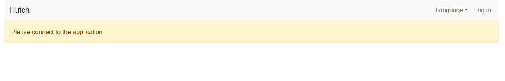

## Setup profile

On first connection, the user will need to setup its profile with a fortune message and a fortune image, and specify a server key to use when signing messages. So on every connection, the user will see the fortune message and the image it has previously chosen, so it can verify it's connected to the correct server, to avoid some attacks like man in the middle.

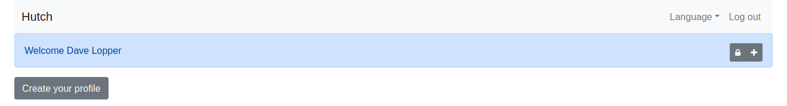

The user must enter a fortune message. This can be anything he or she wants, as long it's no more than 512 characters. It's common to use a citation or any sentence that has a meaning for the user.

The user must also choose either a local image file, not over 400 Kb, or get a random file from [Wikimedia Commons](https://commons.wikimedia.org/wiki/Main_Page).

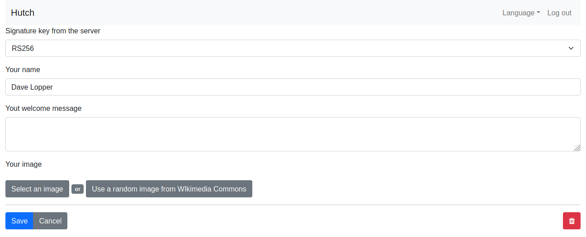

Then, when the profile is set, the user can create and manage safes.

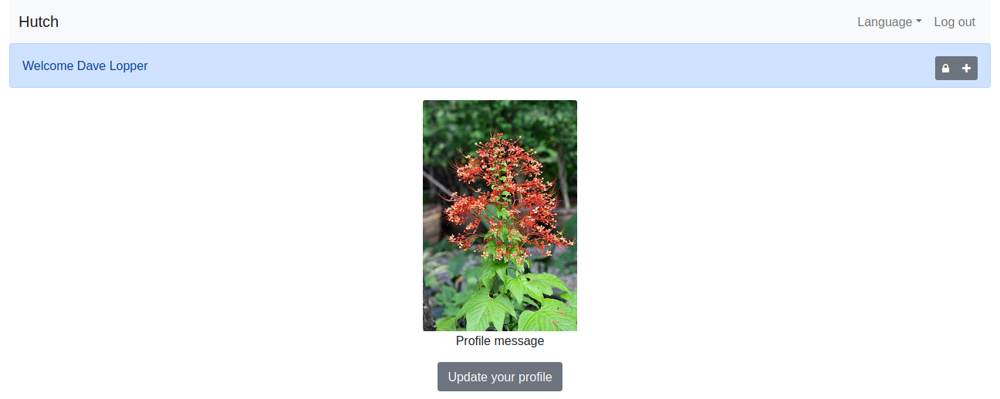

## Lock all safe

This will lock all safe on this device. To reopen them, the user has to unlock one of the safe key, the keys generated using the option `Keep this safe unlocked on the browser` for this browser will be removed.

## Add a new safe

Click on the button on the top right of the profile screen. Set a name for the safe, select a data cypher encryption type, and a key management algorithm.

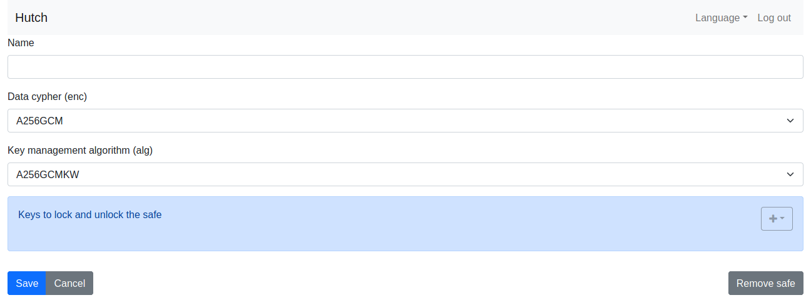

Click on the Save button, you will now have to add a safe key in order to manage your secrets in this safe.

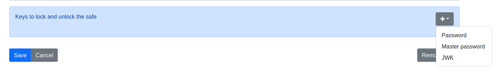

You can add as many safe keys as you want, depending on how you want to access the safe.

### Password safe key

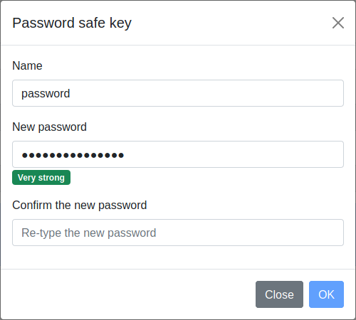

A password safe key is a safe key protected by a password. When you enter a password, its strength is calculated through its length and the different type of characters used. It's recommended to use a `Strong` or `Very strong` password.

### Master password safe key

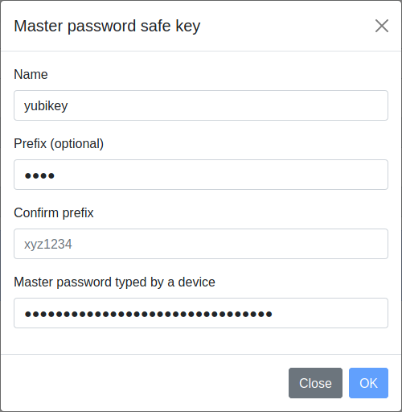

A master password safe key is a safe key protected by a password, but this version is to be used with a device that stores a password, such as a Yubikey. You can use a password prefix, which will be added to the master password. A password prefix is a way to improve the master password security, so if the users has its device stolen, the master password device will not be enough to unlock a safe.

### JWK safe key

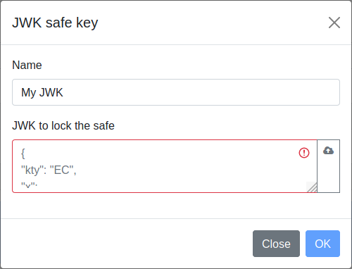

A JWK safe key is a public or symmetric key that will be used to encrypt the safe key. The JWK must contain an `alg` property to specify the key management algorithm to use.

## Safe connection

To access a safe, select it on the tab list on the top left of the screen.

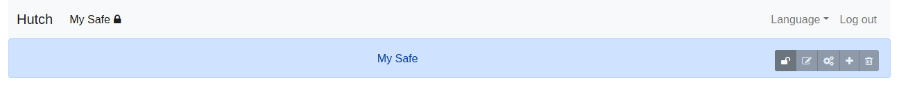

Click on the `unlock` button on the top right of the screen.

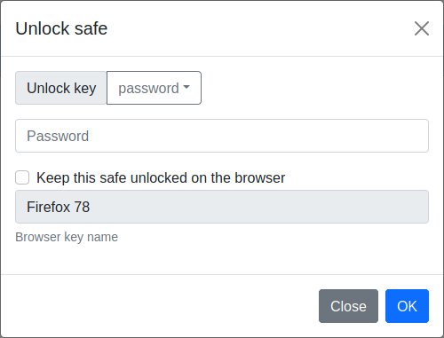

In the unlock safe modal, select the safe key to use to unlock the safe, and enter the (master) password or the private JWK.

If you check the `Keep this safe unlocked on the browser` entry, a special safe key will be created, so you don't have to use you password or private JWK every time you open this safe on this browser.

## Secrets management

When you unlock a safe, you can read, write, update, delete secrets and manage the safe.

### Secrets list

The secrets will be displayed using 2 columns on large enough screens, or 1 column for smaller screens (tablet or phone). All secrets are automatically sorted by their name. The user can also filter the secrets with their name.

To add a new secret, click on the (+) button right to the search input. Then, a new secret modal is displayed.

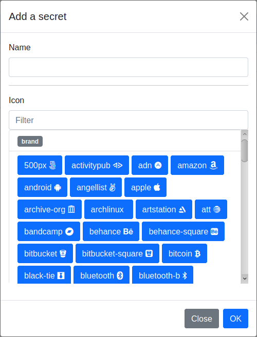

### Secret collapsed

By default, all secrets are collapsed on the list. When a secret is collapsed, the user can click to deploy it to access all values, the user can also copy the sernames or the passwords stored in this secret when it's collapsed by clicking on the buttons.

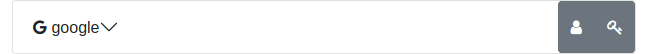

### Secret expanded

When the secret is expanded, all its value are displayed, except for the passwords that are hidden by default.

A value can have the following types:
- url: the url of the service
- login: the login for the service
- password: the password for the service
- secret questions: a set of secret questions and answers for the service to recover a lost password
- file: any file
- miscellaneous data: any text value

A secret can have as many values as possible. The only limit is that a secret can not be over 16Mb once encrypted, which is difficult to reach, unless the user stores large files. You can add as many rows of the same type as the user wants for each secret. Every value can also have a list of tags to distinguish them for example.

Every row can be edited or deleted. An updated or deleted row can't be recovered.

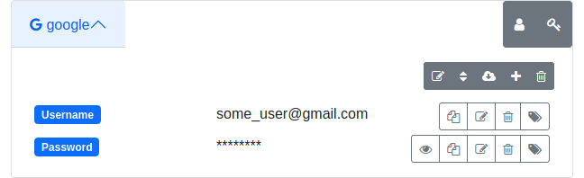

### Sort rows

The user can sort the rows of a secret. First the user must click on the sort button, then he or she can drag and drop each line to place them in a different place on the list.

### Export secret

The user can export this secret alone by clicking on its `Download secret` button. This will open a modal window where the user can select if the secret is exported encrypted or not, then export the secret. This can be useful to exchange secrets between users.

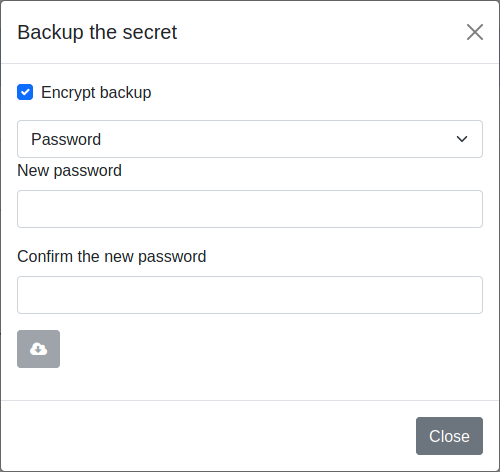

### Edit a row

By clicking on the edit row icon, the user can update the value. He or she can modify the value directly, or, for a password or a secret answer, generate a random value.

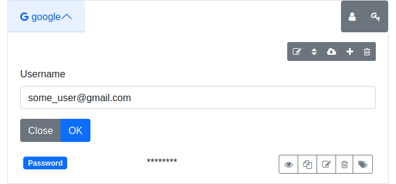

#### Generate a random password

By clicking on the generate random password button, a modal window opens to select the characters available and the length of the generated password.

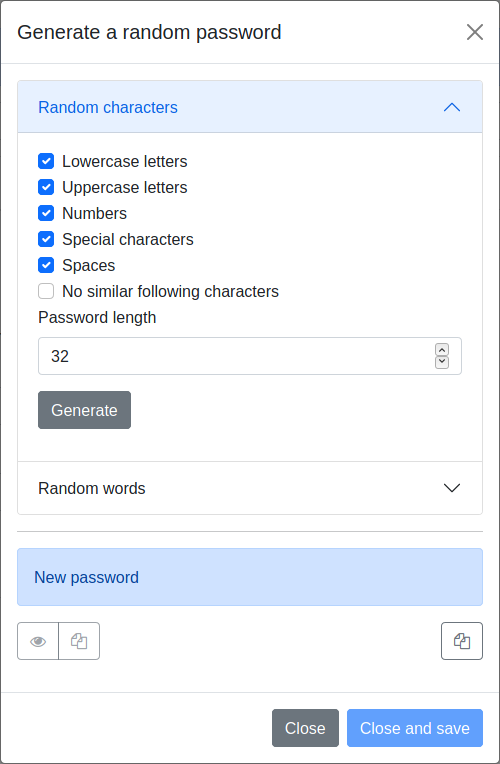

Then the user selects the password options, click on the button `Generate`, then click on the button `OK` to set the new generated password on the row value. The password is never displayed in this process, to protect the privacy. After that, the user can copy the new password in the clipboard and paste it when he or she create or update the password on the service.

A password can be generated out of random characters, or using a set of words from a list of most common words in the language the user uses the application.

#### Generate a random answer for a secret question

A _secret answer_ can also be generated by clicking on the `generate answer` button when the secret question is in edit mode. The answer is generated by picking at random 2 words from a list of most common words in the language the user uses the application. The answer will be totally wrong and that's the purpose, so an attacker won't be able to guess the answer from a background check of the user, but the user will still be able to answer them by using Hutch.

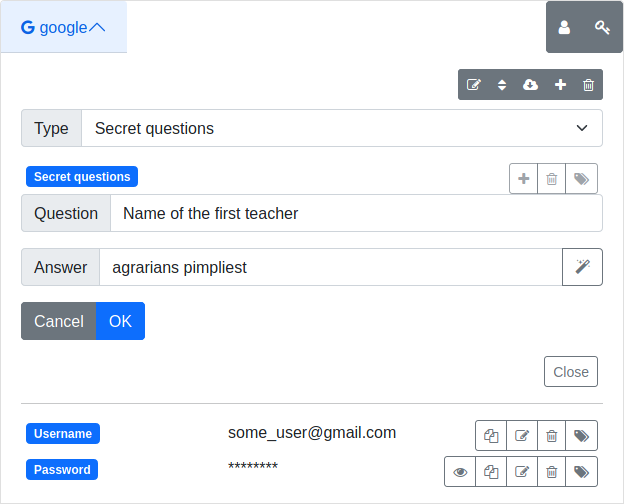

## Safe management

On the top right of the safe tab are the safe action buttons.

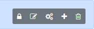

### Lock safe

Lock the safe on the device. To reopen it, the user has to enter the password again, even if he or she checked the option `keep this safe open on this device` before.

### Update safe

This will display the edit safe page, where you can change the safe name, or manage safe keys.

### Import and export safe secrets

This opens a modal window where the user can import or export all safe secrets, the export can be encrypted or not.

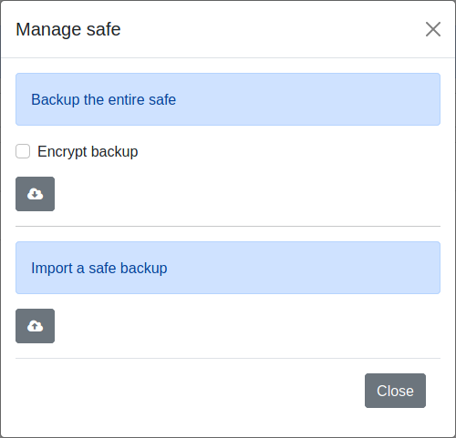

### Delete safe

This will open a confirm modal window to the user. If the user confirms the suppression, the safe will be deleted premanently.
