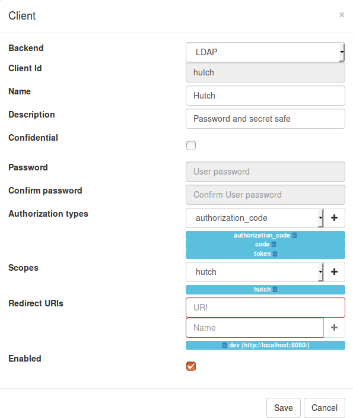

# Hutch Installation

## Upgrade from Hutch 1.0.x to 1.1

A major change was applied to the safe password digest method, Hutch switched from SHA256 to PBKDF2, which means that **ALL** the safes created in Hutch 1.0 **WON'T** be available after migrating to Hutch 1.1.

So proceed with caution, make a backup of the database and the front-end application in case you need to restore them.

To migrate your safes, you can proceed with one of the following procedure.

### Export, migrate, then reimport all safes

Use the `Export safe` functionality for each safe of each user to export all safes into files. The export **must be without password**.

Reconnect to Hutch, recreate new safes, then import all the safe backups in their new safe.

Finally, if everything is working in the new safes, you can delete the old safes.

### Export safe key

Export the safe key for all safes in the `Manage safe` modal.

Upgrade to 1.1 as explained in the upgrade paragraph.

Reconnect to Hutch, lock all safe if they were unlocked, the use the `Reset password` procedure: click on the `Forgot password?`, then use your stored safe key to reset the password.

### Upgrade procedure

You must reinstall the API backend server with the packages available or by recompiling it, then install the updated front-end application files in the path specified by `app_files_path` in the hutch.conf file. There is no change in the database.

## Pre-compiled packages

You can install Hutch with a pre-compiled package available in the [release pages](https://github.com/babelouest/hutch/releases/latest/). The package files `hutch-full_*` contain the package libraries of `orcania`, `yder`, `ulfius` and `hoel` precompiled for `hutch`, plus `hutch` package. To install a pre-compiled package, you need to have installed the following libraries:

```
libmicrohttpd
libjansson
libgnutls
libsqlite3
libssl
libmariadbclient
libconfig
```

For example, to install Hutch with the `hutch-full_1.1.0_Debian_stretch_x86_64.tar.gz` package downloaded on the `releases` page, you must execute the following commands:

```shell
$ sudo apt install -y autoconf libjansson-dev libssl-dev libsqlite3 libmariadbclient libconfig
$ wget https://github.com/benmcollins/libjwt/archive/v1.9.tar.gz
$ tar -zxvf v1.9.tar.gz
$ cd libjwt-1.9
$ autoreconf -i
$ ./configure
$ make && sudo make install
$ wget https://github.com/babelouest/hutch/releases/download/v1.0.12/hutch-full_1.1.0_Debian_stretch_x86_64.tar.gz
$ tar xf hoel-dev-full_1.4.0_Debian_stretch_x86_64.tar.gz
$ sudo dpkg -i liborcania_1.2.0_Debian_stretch_x86_64.deb
$ sudo dpkg -i libyder_1.2.0_Debian_stretch_x86_64.deb
$ sudo dpkg -i libhoel_1.4.0_Debian_stretch_x86_64.deb
$ sudo dpkg -i libulfius_2.3.0_Debian_stretch_x86_64.deb
$ sudo dpkg -i hutch_1.1.0_Debian_stretch_x86_64.deb
```

If there's no package available for your distribution, you can recompile it manually using `CMake` or `Makefile`.

## Build API server

You must install the following libraries including their header files:

```
libmicrohttpd
libjansson
libmysqlclient 
libsqlite3 
libconfig 
libssl
```

On a Debian based distribution (Debian, Ubuntu, Raspbian, etc.), you can install those dependencies using the following command:

```shell
$ sudo apt-get install libmicrohttpd-dev libjansson-dev libmysqlclient-dev libsqlite3-dev libconfig-dev libssl-dev
```

### CMake

Download Hutch from Github, then use the CMake script to build the application:

```shell
# Install Hutch
$ git clone https://github.com/babelouest/hutch.git
$ mkdir hutch/build
$ cd hutch/build
$ cmake ..
$ make 
$ sudo make install
```

### Good ol' Makefile

Download Hutch and its dependendencies hosted in github, compile and install.

```shell
# Install libjwt
$ git clone https://github.com/benmcollins/libjwt.git
$ cd libjwt/
$ autoreconf -i
$ ./configure
$ make
$ sudo make install

# Install Orcania
$ git clone https://github.com/babelouest/orcania.git
$ cd orcania/
$ make
$ sudo make install

# Install Yder
$ git clone https://github.com/babelouest/yder.git
$ cd yder/src/
$ make
$ sudo make install

# Install Ulfius
$ git clone https://github.com/babelouest/ulfius.git
$ cd ulfius/src/
$ make -DWITH_CURL=off -DWITH_WEBSOCKET=off
$ sudo make install

# Install Hoel
$ git clone https://github.com/babelouest/hoel.git
$ cd hoel/src/
$ make -DWITH_PGSQL=off
$ sudo make install

# Install Hutch
$ git clone https://github.com/babelouest/hutch.git
$ cd hutch/src/
$ make 
$ sudo make install
```

## Configuration

Copy `hutch.conf.sample` to `hutch.conf`, edit the file `hutch.conf` with your own settings.

### Data storage backend initialisation

You can use a MySql/MariaDB database or a SQLite3 database file.
Use the dedicated script, `hutch.mariadb.sql` or `hutch.sqlite3.sql` to initialize your database.

### Glewlwyd token validation

You must set the configuration values to correspond with your OAuth2 glewlwyd server. The glewlwyd configuration block is labelled `jwt`

In this block, you must set the value `use_rsa` to `true` if you use RSA signatures for the tokens, then specify the path to the RSA public key file in the value `rsa_pub_file`. If you use an ECDSA signature, set the parameter `use_ecdsa` to true and set the path to your ECDSA public key file. If you use `sha` digest as signature, set `use_sha` to `true`, then specify the secret used to encode the tokens in the value `sha_secret`.

### Install service

The files `hutch-init` (SysV init) and `hutch.service` (Systemd) can be used to have hutch as a daemon. They are fitted for a Raspbian distrbution, but can easily be changed for other systems.

#### Install as a SysV init daemon and run

```shell
$ sudo cp hutch-init /etc/init.d/hutch
$ sudo update-rc.d hutch defaults
$ sudo service hutch start
```

#### Install as a Systemd daemon and run

```shell
$ sudo cp hutch.service /etc/systemd/system
$ sudo systemctl enable hutch
$ sudo sudo systemctl start hutch
```

### Setup Hutch in your Glewlwyd Oauth2 server

If you use a [Glewlwyd](https://github.com/babelouest/glewlwyd) instance as Oauth2 server, you must setup a new client, don't forget to setup properly the new scope, here set to `hutch`, the `client_id` and at least one correct `redirect_uri` value.

Hutch front-end is a Angular2 application, it will need a non confidential client_id, and the authorization types `code` and/or `token`.



## Setup the web application

The web application is located in `webapp/dist`, its source is located in `webapp/src`, go to `webapp/README.md` if you want more details on the front-end implementation.

You can either use the built-in static file server or host the web application in another place, e.g. an Apache or nginx instance.

By design, the web application must be accessible on a root path, e.g. `https://hutch.mydomain.tld/`.

To configure the front-end, rename the file `webapp/dist/config.json.sample` to `webapp/dist/config.json` and modify its content for your configuration.

```javascript
{
  "lang": { // Languages available and default lang
    "available": [
      { "code": "en", "display": "English" },
      { "code": "fr", "display": "Français" }
    ],
    "default": "en"
  },
// Algorithms available are "AES-CBC", "AES-CTR" and "AES-GCM"
// Although, AES-CBC is for now the only one available for browser Safari (Apple devices)
  "webCryptography": {
    "algorithm": "AES-CBC",
    "keyLength": 256  // Values avbailable are 128, 192 or 256 bits
  },
  "api": {
    "baseUrl": "https://resource.server.url/", // Url to your Hutch API base URL
    "maxLength": 16777215                      // Maximum length used for data upload in bytes
  },
  "oauth2Connect": {
      "serverUri": "https://oauth.server.url/",    // URI to the Oauth2 service
      "clientId": "clientxyz",                     // client_id used
      "responseType": "code",                      // can be 'code' or 'token'
      "redirectUri": "https://client.server.url/", // Redirect URI set in your OAuth2 service
      "scope": "hutch",                            // scope required for hutch API
      "authorizePath": "auth/",
      "tokenPath": "token/",
      "storage": "localStorage"                    // Can be 'localStorage' or 'cookie'
  }
}
```

For more strength, 256 bits is recommended as key length. The algorithm choice depends on the clients and your security choices. Although Safari Webkit (MacOS and iOS users) implements only `AES-CBC`. So the default key algorithm is `AES-CBC 256 bits`. You can change it in this file if you like, but if safes are already created before you change the algorithm, their secrets will no longer be available.

### Protect behind Apache mod_proxy

A good practice consists to protect Hutch behind a http proxy. This way you can add specific security rules, redirect to a standard TCP port, e.g. 443, etc.

## Start the server

Run the application using the service command if you installed the init file:

```shell
$ sudo service hutch start
```

You can also manually start the application like this:

```shell
$ ./hutch --config-file=hutch.conf
```

By default, Hutch is available on TCP port 4884, the API is located at [http://localhost:4884/api](http://localhost:4884/api) and the web application is located at [http://localhost:4884/](http://localhost:4884/).
